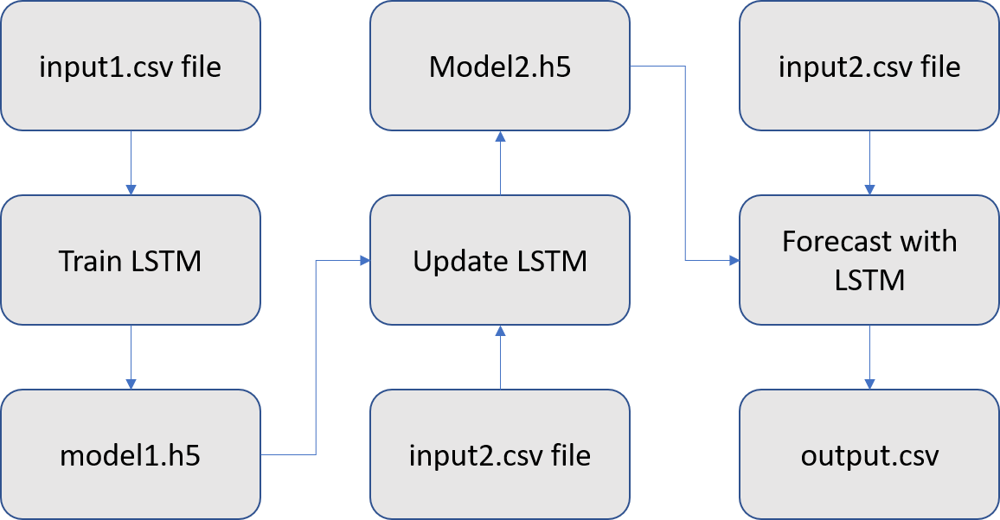

# Predicting Queue Time with LSTM Classifier
## Bright Uchenna Oparaji, Institute for Risk and Uncertainty, University of Liverpool.

The aim of this project is to build a model and forcast the expected queue time of a HPC resource using recurrent neural network (LSTM).
## Getting Started

These instructions will get you a copy of the project up and running on your local machine for development and testing purposes. See deployment for notes on how to deploy the project on a live system.

### Prerequisites

1) Keras 
2) Numpy
3) Pandas
4) Sklearn
5) os
6) time
7) datetime
### Installing libraries

Install Keras from PyPI (recommended):
```
sudo pip install keras
```
If you are using a virtualenv, you may want to avoid using sudo:
```
pip install keras
```
Alternatively: install Keras from the GitHub source:
First, clone Keras using git:
```
git clone https://github.com/keras-team/keras.git
```
Then, cd to the Keras folder and run the install command:
```
cd keras
sudo python setup.py install
```
Similarly, numpy, pandas, sklearn, os, time and datetime can be installed via pip: 
```
pip install numpy

pip install pandas

pip install sklearn

pip install os

pip install time

pip install datetime
```

## Running the code in IPython console

The main engine of the code is located in `lstm_model_final.py`. Within `lstm_model_final.py`, there are three functions (i.e. `train_lstm, update_lstm and forecast_with_lstm`) inside `lstm_model_final.py`. `train_lstm` takes in the training file in `.csv` format, trains an lstm displays the reliability of the trained model on training and validation set respectively, automatically creates a model directory and stores the trained model in the directory. `update_lstm` takes in new training inputs and the directory of the previously trained model, searches for the latest model version, trains the latest model, and stores the updated model in the model directory (i.e. version control). `forecast_with_lstm` takes in new inputs and a model of choice, then make a prediction from the new inputs and stores the prediction in an output directory which is automatically created. In the following, we give a brief demonstration on how to use these functions:
```python
from lstm_model_final import train_lstm, update_lstm, forecast_with_lstm
```
### Using the functions:
```python
train_lstm('C:/Users/BRIGHT/Desktop/ZENOTEC_2/Input/TrainingData_Modified.csv')
```
```python
update_lstm('C:/Users/BRIGHT/Desktop/ZENOTEC_2/Input/TrainingData_Update.csv','C:/Users/BRIGHT/Desktop/ZENOTEC_2/Model' )
```
```python
forecast_with_lstm('C:/Users/BRIGHT/Desktop/ZENOTEC_2/Input/TestDataNoOutput.csv','C:/Users/BRIGHT/Desktop/ZENOTEC_2/Model/20180906020843.h5')
```
### Software Arhitecture


## Author

* **Bright Uchenna Oparaji** 


